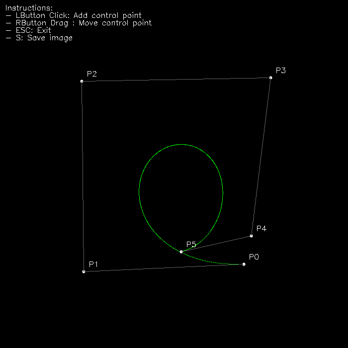
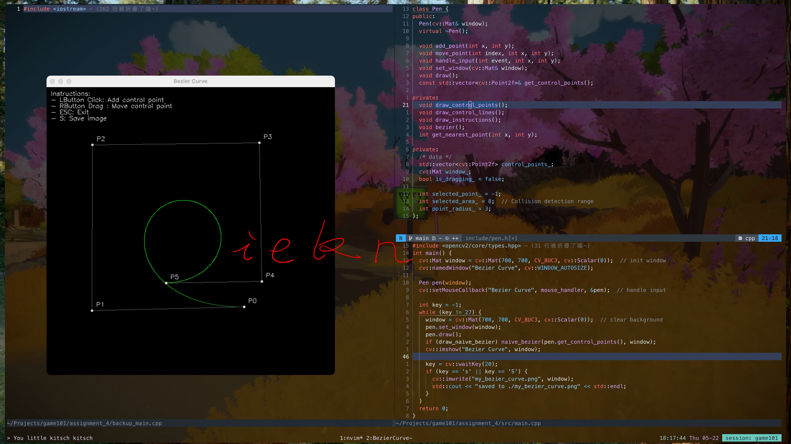

# Assignment 4

  
  

https://github.com/user-attachments/assets/14a0ecac-fcee-40c0-88d0-ea858d17f2e9

  
Toggle

  

| Commands         | Description      |
| :-               | :-               |
| Mouse Left Click | Add new  point   |
| Mouse Right Drag | Move point       |
| Esc              | Quit Application |
| S                | screenshot       |

